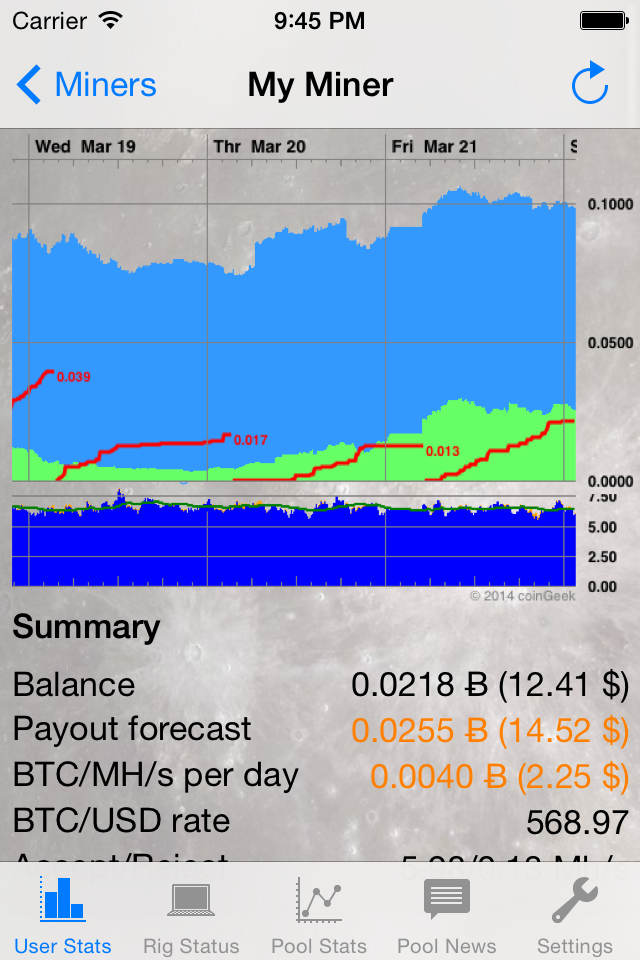
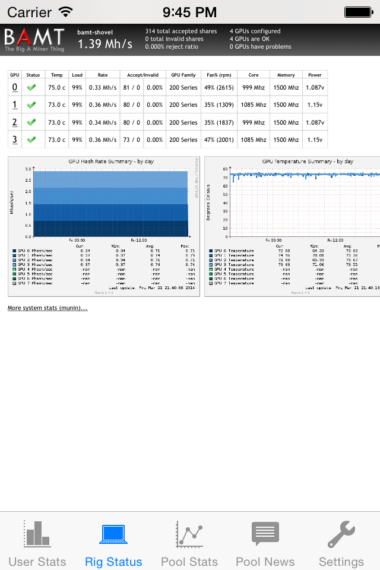
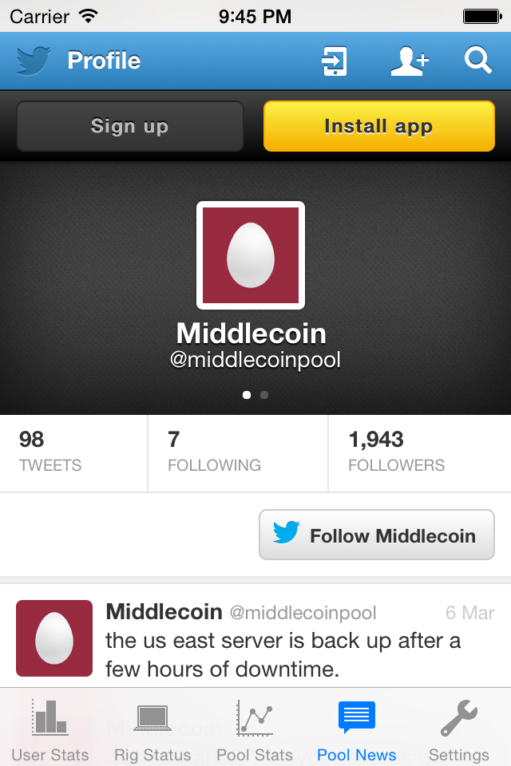

Middlecoin Toolkit was an iOS app used to monitor the status of Bitcoin mining through the Middlecoin mining pool. It was (somewhat briefly) on the iOS app store in early 2014.

The app supported displaying the mining status of an account, showing the mining status of a bitcoin mining rig, as well as displaying the Twitter feed of the Middlecoin pool.

App simulator screenshots:

Main page:

Mining rig status page:

Middlepool twitter status page:

The mining rig and twitter pages were webviews displaying different web pages within the app.
